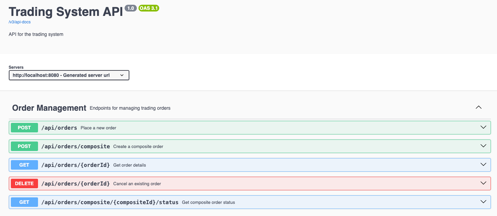

# Trading Platform

This is a Spring Boot-based trading platform that supports order management, including individual and composite orders.

## Prerequisites

• JDK 21+ (Ensure it’s installed and configured)

• Gradle (Uses the wrapper, so no need to install separately)

• Docker & Docker Compose (For running PostgreSQL)

## Running the Application

1. **Start PostgreSQL using Docker Compose**
   Run the following command from the project root:

   ```bash
   docker compose up -d
   ```

This will start a PostgreSQL database (tradingdb) with credentials:

• **User**: user

• **Password**: password

• **Port**: 5432

2. **Build and Run the Application**

Using Gradle:

```bash
./gradlew bootRun
```

The service will start on port **8080**.

**API Documentation**


Once the application is running, you can explore the available endpoints using Swagger UI:

📌 [**Swagger UI**](http://localhost:8080/swagger-ui/index.html)

## **Available Endpoints**

**Order Management**

• **Place an order** (POST)

/api/orders

• **Cancel an order** (DELETE)

/api/orders/{orderId}

• **Get order details** (GET)

/api/orders/{orderId}


**Composite Orders**

• **Create a composite order** (POST)

/api/orders/composite

• **Get composite order status** (GET)

/api/orders/composite/{compositeId}/status

## **Running Tests**

To run unit and integration tests:

```bash
./gradlew test
```

Attention on the class **OrderControllerIntegrationTest.java** to follow how all integration tests were produced.

## Potential Additional Test Scenarios

1. Allow Cancellation After Partial Fill
   2. Traders should be able to cancel the unfilled portion of a partially filled order.
   3. Example: A buy order for 500 shares gets 200 filled, leaving 300 unfilled—trader cancels the remaining 300.
   4. Expected: Order status updates to PARTIALLY_FILLED → CANCELLED, and filled trades remain intact.
   5. Edge cases: Prevent cancellation of fully filled orders.

2. Cancellation of Composite Orders
   3. Traders should be able to cancel unfilled parts of a composite order.
   4. Example: A composite order for AAPL (100 shares) and MSFT (200 shares)—AAPL fills, MSFT remains open, trader cancels MSFT.
   5. Expected: Filled orders remain, unfilled ones get CANCELLED.
   6. Edge cases: Prevent cancellation of fully filled composite orders.